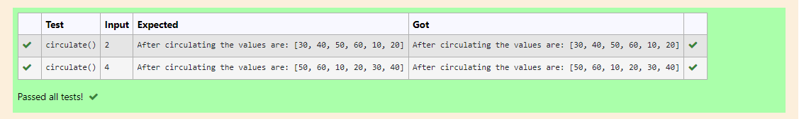

# Circulate-the-values-of-N-variables
## Aim:
To write a python program to circulate the n variables using function concept
## Equipment’s required:
PC
Anaconda - Python 3.7
## Algorithm: 
### Step 1: 
Get the values from the user in list.
### Step 2: 
Get the value from the user for the number of rotation.
### Step 3: 
Using the slicing concept rotate the list.
### Step 4: 
Circulate the number of values in list according to input.
### Step 5: 
Print the list after circulating.
## Program:
```
def circulate():
    l=[10,20,30,40,50,60]
    n=int(input())
    l=l[n:]+l[:n]
    print("After circulating the values are:",l)
```
## Output:

## Result:
Thus the circulating the values  of N variables are successfully executed